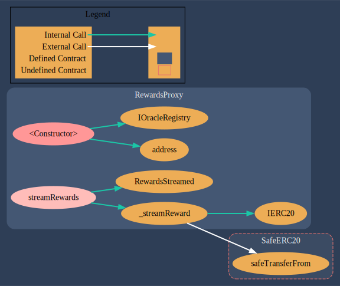

# Alkimiya V2.1 Audit

Audit of the [Alkimiya.io](https://alkimiya.io/) V2.1 [Silica smart contracts](https://github.com/Alkimiya/v2.1-core)

|             |                                                      |
| ----------- | ---------------------------------------------------- |
| **Date**    | August 2023                                              |
| **Auditor** | Tamara Ringas ([@tamaraRingas](https://twitter.com/tamaraRingas)) |

Alkimiya Technologies, Inc.

# About Alkimiya

Alkimiya is a permissionless, open-source protocol for consensus capital markets. Proof-of-work (PoW) miners and proof-of-stake (PoS) validators can create swap contracts to sell their hashpower or staking power to buyers. These orders are facilitated through ERC-20 escrow contracts called Silica.

# Table of Contents

- [Introduction](#introduction)
- [Disclaimer](#disclaimer)
- [Severity classification](#Severity-classification)
- [Scope](#scope)
- [Summary](#summary)
- [Security Findings](#security-findings)
- [Gas Findings](#gas-findings)
- [Appendix I - Process Outline](#process)
- [Appendix II - Static Analysis Reports](#static-analysis)
- [Appendix III - Generated Documentation](#documentation)

# Introduction

Alkimiya requested a security and gas audit as well as any required remediation of the Silica smart contracts as of git commit hash [f92215d](https://github.com/Alkimiya/v2.1-core/commit/f92215d9cc3e38fe4028a1b0d40aa62ce2d5f585).

There were 15 contracts in scope, as well as their parent contracts and corresponding interfaces.

After the audit and additional testing was completed, updates to the codebase were applied and further tests were added which can be found at git commit hash [4ce02ea](https://github.com/Alkimiya/v2.1-core/commit/4ce02ea79f12a132a21849a0a2f8f6dabc82c531).

More information about ALkimiya can be found on their [documentation page](https://alkimiya.io/documentation/)

# Disclaimer

A smart contract security review can never verify the complete absence of vulnerabilities. Each audit is a time, resource and expertise bound effort that cannot guarantee 100% security. Subsequent security reviews and on-chain monitoring are strongly recommended. An Immunify bug bounty program has also been set up for the contracts.


# Severity classification

| Severity         | Description                                                                                                                                                                                                                                    |
| ---------------- | ---------------------------------------------------------------------------------------------------------------------------------------------------------------------------------------------------------------------------------------------- |
|             | A **directly** exploitable security vulnerability that leads to stolen/lost/locked/compromised assets or catastrophic denial of service.                                                                                                       |
|              | A security vulnerability or bug that can affect the correct functioning of the system, lead to incorrect states or denial of service. It may not be directly exploitable or may require certain, external conditions in order to be exploited. |
|         | Assets not at direct risk, but the function of the protocol or its availability could be impacted, or leak value with a hypothetical attack path with stated assumptions, but external requirements.                                           |
|          | A violation of common best practices or incorrect usage of primitives, which may not currently have a major impact on security, but may do so in the future or introduce inefficiencies.                                                       |

# Scope

- Source lines of code (SLOC) in source files: 3020
- Source lines of code (SLOC) in tests : 5654

The following smart contracts were in the scope of the security review:

### Contracts

1. [Abstract Silica](https://github.com/Alkimiya/v2.1-core/blob/main/contracts/AbstractSilicaV2_1.sol)
2. [Silica Factory](https://github.com/Alkimiya/v2.1-core/blob/main/contracts/SilicaFactory.sol)
3. [Silica](https://github.com/Alkimiya/v2.1-core/blob/main/contracts/SilicaV2_1.sol)
4. [Silica ETH Staking](https://github.com/Alkimiya/v2.1-core/blob/main/contracts/SilicaEthStaking.sol)
5. [Swap Proxy](https://github.com/Alkimiya/v2.1-core/blob/main/contracts/SwapProxy.sol)
6. [Rewards Proxy](https://github.com/Alkimiya/v2.1-core/blob/main/contracts/RewardsProxy.sol)
7. [Oracle Registry](https://github.com/Alkimiya/v2.1-core/blob/main/contracts/OracleRegistry.sol)
8. [Oracle](https://github.com/Alkimiya/v2.1-core/blob/main/contracts/Oracle.sol)
9. [Oracle PoS](https://github.com/Alkimiya/v2.1-core/blob/main/contracts/OraclePoS.sol)
10. [ETH Staking Oracle](https://github.com/Alkimiya/v2.1-core/blob/main/contracts/OracleEthStaking.sol)

### Libraries

11. [Order Library](https://github.com/Alkimiya/v2.1-core/blob/main/contracts/libraries/OrderLib.sol)
12. [Reward Math Library](https://github.com/Alkimiya/v2.1-core/blob/main/contracts/libraries/math/RewardMath.sol)
13. [Payout Math Library](https://github.com/Alkimiya/v2.1-core/blob/main/contracts/libraries/math/PayoutMath.sol)
14. [Silica Types](https://github.com/Alkimiya/v2.1-core/blob/main/contracts/libraries/SilicaV2_1Types.sol)

### Storage
15. [Silica Storage](https://github.com/Alkimiya/v2.1-core/blob/main/contracts/storage/SilicaV2_1Storage.sol)


# Summary

The Alkimiya V2 Silica contracts were well written and thoroughly tested. As such, `0 high risk` findings were made, `5 medium findings` were identified and `4 minor findings` found. `10 gas optimisations` were found, 9 of which were implemented which saved a total of `386498 gas` across both deployment costs and recurring function calls. 

# Security Findings

## High Risk (0)

None found.
## Medium Risk (5)

### 1. A vulnerability with the [OpenZeppelin `4.6` ECDSA library](https://github.com/OpenZeppelin/openzeppelin-contracts/blob/release-v4.6/contracts/utils/cryptography/ECDSA.sol) which is vulnerable to the signature malleability exploit was used in `SwapProxy`.

[Here](https://github.com/pcaversaccio/malleable-signatures/tree/main) is a PoC demonstrating how signature malleability using compact signatures can be exectued.

**Resolution**

The vulnerability was patched in version [`4.7.3`](https://github.com/OpenZeppelin/openzeppelin-contracts/releases/tag/v4.7.3). The patched library is now implemented instead of the vulnerable one.

### 2. OpenZeppelin [Ownable library](https://github.com/OpenZeppelin/openzeppelin-contracts/blob/master/contracts/access/Ownable.sol) implemented instead of [Ownable2Step](https://github.com/OpenZeppelin/openzeppelin-contracts/blob/master/contracts/access/Ownable2Step.sol).

The `Ownable` implementation of access control can lead to loss of ownership in the event of a `transferOwnership()` call. If the owner mistypes the `newOwner` address, there is no way to recover that ownership.

**Recommendation**

It is recommend to use a two-step ownership transfer procedure, including the confirmation (accept) of the ownership transfer.

**Resolution**

Two-step ownership transfer was implemented by using [Ownable2Step](https://github.com/OpenZeppelin/openzeppelin-contracts/blob/master/contracts/access/Ownable2Step.sol).

### 3. Lack of Pause functionality

In the event of the presence of a bug or vulnerability in the codebase, there was no way to prevemt new Silica from being created or pausing the contracts until they were remedied.

Pause functionality was therefore implemented on the `SilicaFactory`, `SwapProxy` and `RewardsProxy` contracts via inheritance of the the [Pausable](https://github.com/Alkimiya/v2.1-core/blob/main/contracts/Pausable.sol) contract. 

```Solidity
// SPDX-License-Identifier: MIT
pragma solidity 0.8.19;

import "@openzeppelin/contracts/access/Ownable2Step.sol";
import "./interfaces/pause/IPausable.sol";

contract Pausable is Ownable2Step, IPausable {

  bool public paused;

  modifier whileNotPaused() {
    require(!paused, "Contract is currently paused");
    _;
  }

  function pause() external onlyOwner {
    paused = true;
    emit contractPaused(address(this));
  }

  function activate() external onlyOwner {
    paused = false;
    emit contractActivated(address(this));
  }
}
```
### 4. Owner account was an EOA

For all `Ownable` smart contracts except the `Silica` & `SilicsETHStaking` ones, the `owner` account is the Alkimiya team. This account has many privledges that allow it to control the smart contract system. 

The previous `owner` address was that of an `externally owned account`, which poses a risk to the system because it can be comprimised and the new  controller of the `owner` address would have immense control over the system.

**Resolution**

The `owner` account was transferred to a `multisig` smart contract, where multiple actors (EOA wallets) need to sign a transaction for it to be executed.

### 5. Lack of token validity check

In `OracleRegistry.sol`, the function `setOracleAddress()` creates an oracle by setting the approved oracle address to correspond to an input token. 

```Solidity
function setOracleAddress(
        address _token,
        uint256 _oracleType,
        address _oracleAddr
    ) public onlyOwner {      
        oracleRegistry[_token][_oracleType] = _oracleAddr;
        emit OracleRegistered(_token, _oracleType, _oracleAddr);
    }
```

**Recommendation**

Add checks to ensure that the `token` and `oracle` addresses are valid.

**Resolution**

```Solidity
function setOracleAddress(
        address _token,
        uint256 _oracleType,
        address _oracleAddr
    ) public onlyOwner {
        require(_token != address(0), "Invalid Token Address");
        require(_token.code.length > 0, "Invalid Token Contract");
        require(_oracleAddr != address(0, "Invalid Oracle Address"))

        oracleRegistry[_token][_oracleType] = _oracleAddr;
        emit OracleRegistered(_token, _oracleType, _oracleAddr);
}
```
## Minor (4)

### 1. The test suite was found to have test coverage gaps

- Unit tests for `RewardMath` & `PayoutMath` were added.

- Fuzz tests were added for all contracts.

### 2. Floating Pragma set 

All smart contracts had a floating pragma set. 

```Solidity
pragma solidity ^0.8.4;
```

This was replaced by solc version `0.8.19` which is a stable version of the Solidity compiler.

```Solidity
pragma solidity 0.8.19;
```

The use of version `0.8.19` also allowed for naming of mapping elements. 

### 3. Internal function naming conventions not followed 

In Solidity, it is best practice for internal functions to named as follows

```Solidity
function _internalFunction() internal {}
```

This naming convention was implemented across all smart contracts.

### 4. Natspec missing

Comments were added to all smart contracts and Foundry documentation was created.

# Gas Findings

## Total Gas Saved

- Once-off deployment calls = `282506 gas`
- Recurring calls = `103992 gas`
- Total = `386498 gas`

## Findings

### 1. Array optimisations

- `i++` ⇒ `++i`
- Unchecked increment of `i`
- `i` is default to `zero`, needn't set it

**Before**

```Solidity
function getInRange(
        uint256 _firstDay,
        uint256 _lastDay
    ) external view override returns (uint256[] memory hashrateArray, uint256[] memory rewardArray) {
        uint256 numElements = _lastDay + 1 - _firstDay;

        rewardArray = new uint256[](numElements);
        hashrateArray = new uint256[](numElements);

        for (uint256 i = 0; i < numElements; i++) {
            AlkimiyaIndex memory indexCopy = index[_firstDay + i];
            rewardArray[i] = indexCopy.reward;
            hashrateArray[i] = indexCopy.hashrate;
        }
}
```

**After**

```Solidity
function getInRange(
        uint256 _firstDay,
        uint256 _lastDay
    ) external view override returns (uint256[] memory hashrateArray, uint256[] memory rewardArray) {
        uint256 numElements = _lastDay + 1 - _firstDay;

        rewardArray = new uint256[](numElements);
        hashrateArray = new uint256[](numElements);

        for (uint256 i ; i < numElements; ) {
            AlkimiyaIndex memory indexCopy = index[_firstDay + i];
            rewardArray[i] = indexCopy.reward;
            hashrateArray[i] = indexCopy.hashrate;
            unchecked { ++i; }
        }
}
```

This three-step optimisation was applied to all arrays.

**Before**


**After**


### RewardsProxy
⇒ `RewardsProxy` deployment cost decreased by `9806 gas` (Once off expense)

⇒ `streamRewards()` call decreased by `155 gas (per call)` 

Total `RewardProxy`gas saved = `9961 gas`

- Once-off calls = `9806 gas`
- Recurring calls = `155 gas`

### SilicaV2_1
⇒ `SilicaV_1` deployment cost reduced by `11207 gas` (Once off expense)

⇒ `buyerCollectPayout()` calls reduced by `4745 gas per call` 

⇒ `buyerCollectPayoutOnDefault()` calls reduced by `578 gas per call`

⇒`getDayofDefault()` calls reduced by `357 gas per call`

⇒ `getRewardDeliveredSoFar()` calls reduced by `378 gas per call`

⇒ `getRewardDueNextOracleupdate()` calls reduced by `7404 gas per call`

⇒ `getStatus()` calls reduced by `7495 gas per call`

⇒ `isDefaulted()` lookup reduced by `93 gas per call`

⇒ `isFinished()` lookup reduced by `93 gas per call`

⇒ `isRunning()` lookup reduced by `93 gas per call`

⇒ `proxyDeposit()` calls reduced by `382 gas per call`

⇒ `reservedPrice()` lookup increased by `7 gas per call` 

⇒`sellerCollectPayout()` calls reduced by `3285 gas per call`

Total `SilicaV2_1` gas saved = `36103 gas`

- Once-off-payments = `11207 gas`
- Recurring calls = `24896 gas`

### 2. Variable read optimisation

- In `AbstractSilicaV2_1` the constant state variable `DAYS_BETWEEN_DD_AND_FDD` was a `uint8`
- In `SilicaV2_1` & `SilicaEthStaking` the commodity_type variable was stored as a `uint8`

In Solidity, smaller variable types only save gas when they are packed together into shared storage slots. The above `unit8` variables were not packed with anything, making them more expensive than `uint256` because for Solidity to read those variable values, it still access a whole `uint256` slot which requires casting the smaller variable into a `uint256` one.

**Before**


**After**


### SilicaV2_1

`SilicaV2_1` deployment cost reduced by `1200 gas` (Once off expense)

`deposit()` calls reduced by `21 gas per call`

`getStatus()` calls reduced by `51 gas per call`

`isOpen()` calls reduced by `26 gas per call`

`lastDueDay()` calls reduced by `26 gas per call`

`proxyDeposit()` calls reduced by `21 gas per call`

- Total Silica gas saved = `1345 gas`
- Deployment gas saved = `1200 gas`
- Recurring calls gas saved = `145 gas`

*`SilicaEthStakingV2_1` would have had similar gas reductions but no gas report could be produced.

### 3. Use of `calldata` instead of `memory`

Instead of copying function parameters to `memory`, it is typically more cost-effective to load them immediately from `calldata.` If all you need to do is `read` data from function params, you can conserve gas by saving the data in `calldata` instead.

⇒ `Oracle.sol`’s read only function function parameters that were stored in `memory` were changed to be read straight from `calldata`

⇒ `OracleEthStaking.sol`’s read only function function parameters that were stored in `memory` were changed to be read straight from `calldata`

⇒ `RewardsProxy.sol`’s read only function function parameters that were stored in `memory` were changed to be read straight from `calldata`

⇒ `SwapProxy.sol`’s read only function function parameters that were stored in `memory` were changed to be read straight from `calldata`

**Before**

### Oracle
```Solidity
FillBuyOrder:testAdditionalCollateral(uint256) (runs: 256, μ: 156644, ~: 54359)
```

### OracleETHStaking
```Solidity
OracleEthStakingUpdate:testInvalidPublisherSignature() (gas: 30968)
```

### Rewards proxy


```Solidity
RewardsProxyTest:testStreamRewards() (gas: 222921)
```

### Swap Proxy


```Solidity
CancelBuyOrder:testCancelledOrderCannotBeFulfilled() (gas: 45966)
```

**After**

### Oracle

```Solidity
CancelBuyOrder:testCancelledOrderCannotBeFulfilled() (gas: 45966)
```
⇒ 9589 gas saved

### Oracle ETH Staking

```Solidity
OracleEthStakingUpdate:testInvalidPublisherSignature() (gas: 30814)
```

⇒ updateOracleETHStaking calls (on revert) reduced by 154 gas

### Rewards Proxy


```Solidity
RewardsProxyTest:testStreamRewards() (gas: 222710)
```

⇒ `RewardsProxy` deployment cost reduced by `12613 gas`(once-off payment)

⇒ `streamRewards()` calls reduced by `211 gas per call`

### Swap Proxy


```Solidity
CancelBuyOrder:testCancelledOrderCannotBeFulfilled() (gas: 45930)
```

⇒ `SwapProxy` deploy cost increased by `23629 gas` (once-off payment)

⇒ `fillBuyOrder()` calls decreased by `44807 gas per call`

⇒ `cancelBuyOrder()` calls (with revert) decreased by `36 gas per call`

⇒ `11016 gas cost incurred for deployment`(once-off payment)

⇒ `54797 gas saved on recurring calls`

### 4. Library embedding

In `OrderLib` there were both `internal` and `external` functions. Solidity libraries can either be embedded (all internal functions) or extended (all external functions) Embedded libraries inherit the library code into their `bytecode`, so calling the library functions requires only a `JUMP` instruction instead of a `delegatecall` which reduces runtime gas usage for function calls.

- The external functions were made internal to make the library embedded and not extended as well, reducing gas costs of function calls by negating the need of excess `delegatecalls`.

**Before**

```Solidity
CancelBuyOrder:testCancelledOrderCannotBeFulfilled() (gas: 45966)
CancelBuyOrder:testOrderMarkedAsCancelled() (gas: 29735)
CancelSellOrder:testCancelledOrderCannotBeFulfilled() (gas: 45764)
CancelSellOrder:testOrderMarkedAsCancelled() (gas: 29624)
RouteBuy:testOrderMarkedAsCreated() (gas: 144035)
```

**After**

```Solidity
CancelBuyOrder:testCancelledOrderCannotBeFulfilled() (gas: 45966)
CancelBuyOrder:testOrderMarkedAsCancelled() (gas: 25653)
CancelSellOrder:testCancelledOrderCannotBeFulfilled() (gas: 45764)
CancelSellOrder:testOrderMarkedAsCancelled() (gas: 25643)
RouteBuy:testOrderMarkedAsCreated() (gas: 143963)
```

### SwapProxy

`cancelBuyOrder()` calls cost reduced by `4082 gas per call`

`cancelSellOrder()` calls decreased by `3981 ****gas per call`

`routeBuy()` calls decreased by `72 gas per call`

- `8135 gas` saved on recurring function calls

### 5. Tight variable packing 

In `SilicaV2_1 storage`, some variables were not packed into shared `storage slots`.

The most gas costly operation in Solidity is a write to `storage`, so these variables were reordered to enable variable packing which reduced the storage size by two slots.

**Before**


```Solidity
BuyerCollectPayout:testBuyerTriesCollectPayoutWhenOpen() (gas: 151502)
BuyerCollectPayout:testBuyerTriesCollectPayoutWhenRunning() (gas: 176324)
BuyerCollectPayout:testBuyerTriesToCollectTwice() (gas: 76221)
BuyerCollectPayout:testBuyersCollectPayoutOnFinishedContractWithExcess() (gas: 108261)
```

**After**


⇒ `createEthStakingSilicaV2_1()` calls reduced by `536 gas per call`

⇒ `createSilicaV2_1()` calls reduced by `564 gas per call`

⇒ `proxyCreateSilicaV2_1()` calls reduced by `14694 gas per call`

⇒ `15794 gas saved on recurring function calls`

### 6. Function visibility updates

In Solidity, if a function is only to be called `externally` but is defined with a visibility of `public`, gas can be saved by changing the visibility to `external` explicitly.

### 7. Unnecessary local variables

Unnecessary local variables were removed from both the `RewardsProxy` and `SwapProxy` contracts.

### 8. Oracle optimisations

(These changes were rolled back for V2 release due to existing Silica contracts relying on them, but will be implemented in V3. The associated gas reductions are therefore not included in the tally)

⇒ **Removal of Unnecessary Write Operations**

- In `Oracle.sol` , the parameter `difficulty` was written to but never read from, this parameter was removed, negating a daily storage write in `AlkimiyaIndex`, and reads from it in `SilicaV2_1`.

- In `OracleEthStaking.sol`, the parameters `priorityFee, burnFee, priorityFeeNormalized and burnFeeNormalized`  were written to but never read from within the smart contracts, removal negated several daily storage writes in `AlkimiyaEthStakingIndex`, and reads from it in `SilicaEthStaking`.

### Oracle
**Before**


```Solidity
getRewardDueNextOracleUpdate:testWhenRunning() (gas: 5516249)
E2E_DefaultedEthStaking:testE2EToDefault() (gas: 836119)
E2E_Expired:testE2EToExpiry() (gas: 341256)
E2E_ExpiredEthStaking:testE2EToExpiry() (gas: 338865)
E2E_Finish:testE2E120DaysToFinish() (gas: 73017087)
E2E_Finish:testE2E3DayToFinish() (gas: 788709)
E2E_Finish:testE2E60DaysToFinish() (gas: 20091143)
E2E_FinishedEthStaking:testE2EFinished() (gas: 840026)
OracleUpdate:testUpdateRewardTokenOracleIndex() (gas: 110983)
```

**After**


```Solidity
getRewardDueNextOracleUpdate:testWhenRunning() (gas: 5481525)
E2E_DefaultedEthStaking:testE2EToDefault() (gas: 836119)
E2E_Expired:testE2EToExpiry() (gas: 341008)
E2E_ExpiredEthStaking:testE2EToExpiry() (gas: 338865)
E2E_Finish:testE2E120DaysToFinish() (gas: 72445622)
E2E_Finish:testE2E3DayToFinish() (gas: 786746)
E2E_Finish:testE2E60DaysToFinish() (gas: 19947822)
E2E_FinishedEthStaking:testE2EFinished() (gas: 837408)
OracleUpdate:testUpdateRewardTokenOracleIndex() (gas: 110193)
```

⇒ `SilicaFactory.sol` deployment cost increased by `14613 gas` (once-off payment)

⇒ `createSilicaV2_1()` calls reduced by `109 gas per call`

⇒ `proxyCreateSilicaV2_1()` calls reduced by `14335 gas per call`

⇒ `fillBuyOrder()` calls reduced by `44896 gas per call`

⇒ `fillSellOrder()` calls reduced by `76 gas per call`

⇒ `routeBuy()` calls reduced by `55 gas per call`

⇒ `getRewardDueNextOracleUpdate()` reduced by `34724 gas` (when in running state)

⇒ `E2E-Expiry()` test was reduced by `248 gas`

⇒ `E2E-120DaysToFinish()` test was reduced by `571465 gas`

⇒ `E2E-3DaysToFinish()` test was reduced by `1963 gas`

⇒ `E2E-60DaysToFinish()` test was reduced by `143321 gas`

⇒ `E2E-Finish()` test was reduced by `2618 gas`

⇒ `updateIndex()`test was reduced by `790 gas`

### Oracle ETH Staking

**Before**


```Solidity
OracleEthStakingUpdate:testGetInRange() (gas: 796954)
OracleEthStakingUpdate:testUpdateIndex() (gas: 200950)
E2E_FinishedEthStaking:testE2EFinished() (gas: 840026)
```

**After**


```Solidity
OracleEthStakingUpdate:testGetInRange() (gas: 796954)
OracleEthStakingUpdate:testUpdateIndex() (gas: 200950)
E2E_FinishedEthStaking:testE2EFinished() (gas: 840026)
```

⇒ `SilicaFactory` deployment cost reduced by `8607 gas` (once-off payment)

⇒ `createSilicaEthStakingV2_1()` calls reduced by `8687 gas per call`

⇒ `testGetInRange()` test reduced by `467700 gas per call`

⇒`testUpdateIndex()` test reduced by `100310 gas per call`

⇒ `testE2EFinish()` test reduced by `2618 gas per call`

&nbsp;

⇒ **Parameter Resizing & Packing**

- In `Oracle.sol` , the parameters of `AlkimiyaIndex` are not all of size `256`, the variables `referenceBlock`, `timestamp` & `hashrate` are smaller integer types which allows for them to all be packing into one storage slot.
- In `OracleEthStaking.sol`, the parameters of `AlkimiyaEthStakingIndex` are both of size `256` even though one is a `timestamp` These variables were resized to save on a storage slot write and reads of it in `AlkimiyaEthStakingIndex`

### 9. Unused Vault code

Removed (comment out) unused `Vault` code in `SwapProxy`.

**Before**


**After**


### SwapProxy

⇒ `SwapProxy` deployment cost decreased by `271309 gas` (Once off expense)

⇒ `buyOrderCancelled`  lookup decreased by `11 gas per call`

⇒ `fillBuyOrder()` calls decreased by `11 gas per call`

⇒ `sellOrdersCancelled` lookup decreased by `56 gas per call`

⇒ `setSilicaFactory()` calls decreased by `12 gas per call`

⇒ `routeBuy()` calls increased by `9 gas per call`

⇒ `sellOrderToSilica` lookup increased by `11 gas per call`

Total SwapProxy gas saved = `271379 gas`

- Once-off calls = `271309 gas`
- Recurring calls = `70 gas`

### 10. Unused imports

Removed all unused imports.

# Appendices

## Appendix I - Process Outline

**Alkimiya V2.1 Smart Contract Audit  Process Outline**

1. **Protocol Investigation (Build mental model of protocol as a whole)**
    - Architectural outline
    - Review all current documentation
    - Follow user flows
    - Create call graphs & UML with Surya & Sol2UML
    - List invariants
    
2. **Scope Definitions**
    - Solidify which contracts are in and out of scope
    - Remove out of scope contracts, if possible
    
3. **Review Prior Security Work**
    - Examine previous audits
    - Find any attack vectors the team has already found and review their patches

4. **Audit Preparation**
    - Examine SLOC to estimate audit duration
        - Source lines of code (SLOC) in source files: 3020
        - Source lines of code (SLOC) in tests : 5654
    - Tooling setup (Foundry, Slither, MythX, Olympix)
    - Run tests and examine coverage for any gaps
    - Read through code at a high level, tagging initial thoughts to come back to in more detail later
    
5. **In-Depth Code Review**
    - Read each line in detail
    - Review previous tags in more detail
    
6. **Write More Tests**
    - Fill in any coverage gaps found
    - Add fuzz testing
    
7. **Static Analysis**
    - Use Slither’s CLI to catch common issues
    - Use Olympix to run high level security review
    - Generate detailed static-analysis report using MythX
    - Use Slither to write custom static checks
    - Tag all static analysis findings in code to review again later
    - Make necessary changes to the code based on static analysis findings

8. **Attack Vector Ideation**
    - Enumerate all of the knobs an attacker can control.
    - What public/external functions are there?
    - What state could they affect?
    - Does it matter if some of these transactions are front-run?
    - Can sending ERC20 tokens or Ether to an address change the behaviour of the contracts?
    - Investigate how all listed invariants could possibly be broken
    
9. **Write Proof of Concepts for any Suspected Attack Vectors**
    - Write commented code to execute any suspected attack vectors, documenting results of their feasibility
    
    
10. **Review All Audit Tags & Comments**
    - Go over all tags made in audit again and review them once more
    - Remove all audit tags once accuracy of each has been determined
    
11. **Gas Investigation**
    - Gas snapshots
    - Gas optimisation review
    - Implement gas optimisations

12. **Write up Audit Report**
    - For each valid finding, populate a slide in the report with the description, file/line, criticality, status, and remediation
    - Deliver the report along with the test suite

## Appendix II - Static Analysis Reports

Static analysis was conducted useing [Slither](https://github.com/crytic/slither), [Olympix](https://www.olympix.ai/) and [MythX](https://mythx.io/).

The following reports were generated:

- [MythX QuickMode System Report](./reports/Mythx%20Report%201.pdf)
- [MythX Rewards Proxy Report](./reports/MythX%20RewardsProxy%20Report.pdf)
- [MythX Silica Report](./reports/SilicaV2_1.pdf)
- [MythX Silica ETH Staking Report](./reports/SilicaEthStaking%20MythX%20Report.pdf)

- [Slither Low Findings](./reports/slither-findings.md)
- [Slither Report](./reports/slither-findings.md)

## Appendix III - Generated Documentation 

## UML Diagrams

### System Class Diagram


### Abstract Silica


### Silica Factory


### Oracle Registry


### Oracle


### Oracle ETH Staking


### Rewards Proxy 


### Swap Proxy


## Function Call Graphs 

### Abstract Silica


### Silica Factory


### Silica


### Silica ETH Staking


### Oracle Registry


### Oracle


### Oracle ETH Staking


### Rewards Proxy 


### Swap Proxy


